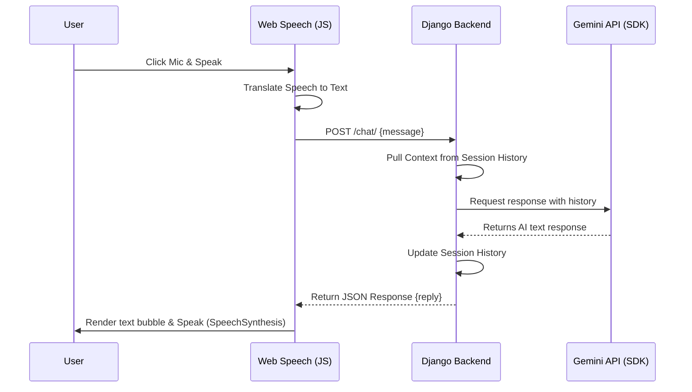

# AURION VOICE AI – Smart Real-Time Voice Assistant SaaS

AURION VOICE AI is a real-time, production-ready AI Voice Assistant web application built from scratch. It features a stunning, premium dark-mode SaaS user interface with full glassmorphism elements, micro-animations, and responsive layouts. The application integrates seamlessly with the Google Gemini API (using the official Google Generative AI Python SDK) through a clean, performant Django backend.

---

## 🚀 Features

1. **Real-Time Voice Input:** High-performance, low-latency microphone capture utilizing the browser's native Web Speech Recognition API.
2. **Google Gemini API Integration:** Generates intelligent, context-aware responses powered by `gemini-1.5-flash`.
3. **Premium SaaS UI:** Beautiful dark mode default, neon purple and blue glow orbs, translucent glassmorphic components, sliding transitions, and interactive animation states.
4. **Pulsing Mic States:** Interactive microphone widget that visualizes active status: "Ready", "Listening...", "Processing...", "AI Responding...", and "AI Speaking...".
5. **Optional Speech Output (TTS):** Utilizes the browser's native Web Speech Synthesis API to read responses aloud with toggle controls.
6. **Session-Based Conversation Memory:** Retains chat history within standard Django session storage, enabling continuous context-aware conversations.
7. **Graceful Text Fallback:** Full keyboard input form for environments where voice input isn't supported or requested.
8. **Production Ready & Deployable:** Configured for out-of-the-box deployment to Render using Gunicorn and WhiteNoise static asset serving.

---

## 🛠️ Tech Stack

- **Backend:** Python 3, Django, Google Generative AI SDK, python-dotenv
- **Frontend:** HTML5, Vanilla CSS3 (SaaS Glassmorphic styling), Custom Javascript (micro-interactions and Speech APIs only, NO bulky frameworks like React/Vue)
- **Deployment:** Gunicorn, WhiteNoise, Render yaml configs

---

## 📁 Project Structure

```text
aurion_voice_ai/
│
├── assistant/
│   ├── views.py              # Index page and POST /chat/ API endpoints
│   ├── urls.py               # Assistant route patterns
│   ├── gemini_service.py     # Google Generative AI SDK initialization and client queries
│
├── aurion_voice_ai/
│   ├── settings.py           # Project settings (Whitenoise, databases, template configurations)
│   ├── urls.py               # Global routing paths
│
├── templates/
│   ├── index.html            # Main interface markup
│
├── static/
│   ├── css/style.css         # SaaS layout styling, gradients, and keyframe animations
│   ├── js/mic.js             # Voice transcription, fetch API, and SpeechSynthesis logic
│
├── manage.py                 # Django CLI management script
├── requirements.txt          # Project dependencies
├── .env                      # Local configuration file (ignored in git)
├── .env.example              # Template config file
├── build.sh                  # Render deployment script
├── Procfile                  # Procfile for web server processes
├── render.yaml               # Infrastructure-as-code configuration for Render
└── README.md                 # Project guide
```

---

## 🎤 Voice System Design Flow



1. **Capture:** The browser's Web Speech Recognition API turns audio waves into text.
2. **Relay:** The client Javascript forwards the query via the Fetch API with standard CSRF protection headers.
3. **Reasoning:** The Django backend pulls the session history, merges the system personality prompt with the latest request, and sends the prompt history to Gemini.
4. **Render:** The backend records the model response and returns it to the client. The UI formats the markdown and, if enabled, reads the plain text using the browser's Synthesis engine.

---

## ⚙️ Setup and Installation

### 1. Prerequisites
- Python 3.9+
- A Google Gemini API Key. (Get a key from [Google AI Studio](https://aistudio.google.com/))

### 2. Clone and Setup Project
```bash
# Navigate into the project folder
cd "AURION VOICE AI – Smart Real-Time Voice Assistant"

# Create a virtual environment
python -m venv venv

# Activate the virtual environment
# On Windows (Command Prompt):
venv\Scripts\activate.bat
# On Windows (PowerShell):
venv\Scripts\Activate.ps1
# On macOS/Linux:
source venv/bin/activate
```

### 3. Install Dependencies
```bash
pip install -r requirements.txt
```

### 4. Configure Environment
Copy `.env.example` to `.env` and fill in your Gemini API key:
```bash
cp .env.example .env
```
Inside `.env`:
```env
SECRET_KEY=your_secret_key_here
DEBUG=True
ALLOWED_HOSTS=localhost,127.0.0.1
GEMINI_API_KEY=AIzaSy... (your API key)
```

### 5. Run Database Migrations
Create databases and session configurations:
```bash
python manage.py migrate
```

### 6. Start the Development Server
```bash
python manage.py runserver
```
Open [http://127.0.0.1:8000/](http://127.0.0.1:8000/) in your web browser.

---

## 🚀 Deployment Guide (Render)

This repository includes a `render.yaml` manifest that defines all the settings needed to host the project on Render's Python web service.

### Automated Steps:
1. Push your code to a GitHub repository.
2. Log into the [Render Dashboard](https://dashboard.render.com/).
3. Click **New +** and select **Blueprint**.
4. Connect your GitHub repository.
5. Render will automatically parse the `render.yaml` file.
6. Under environmental settings, you will be prompted to enter your **GEMINI_API_KEY**.
7. Click **Deploy**. Render will run `./build.sh` (installing dependencies, collecting statics, running database migrations) and spin up the Gunicorn server.

---

## 🖼️ Screenshots

*Placeholder for dashboard and UI interface screenshots*
*(Default UI loads a dark glassmorphic chat module with neon pulsing rings)*
